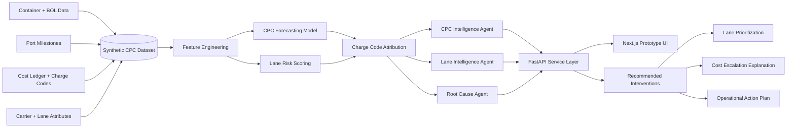

# PortPulse AI: Agentic CPC Intelligence for Inbound Ocean Logistics

A GitHub-ready prototype that combines synthetic logistics data, machine learning, explainable cost attribution, and an agentic reasoning layer to analyze and predict **Cost Per Container (CPC)** across inbound ocean logistics lanes.

This project is intentionally built with synthetic data and generic U.S. port operations. It does **not** use proprietary company data.

---

## 🚢 Problem Statement

Inbound ocean logistics teams often track container milestones, carrier updates, cost ledgers, and invoice events across multiple systems. They can usually answer:

> What was the CPC last week?

But the more valuable questions are harder:

- Why did CPC increase?
- Which lanes are likely to exceed CPC targets?
- Which charge codes are driving the escalation?
- Which lanes need operational intervention before costs materialize?

This prototype explores how ML + Agentic AI can transform CPC from a lagging KPI into a proactive decision layer.

---

## 🧭 Scope

Focused on inbound ocean logistics through major U.S. gateway ports:

- USLAX — Los Angeles
- USLGB — Long Beach
- USOAK — Oakland
- USSEA — Seattle/Tacoma
- USNYC — New York/New Jersey
- USSAV — Savannah
- USNOR — Norfolk
- USHOU — Houston

Rail and downstream domestic movement are intentionally excluded to keep the prototype focused on ocean inbound cost intelligence.

---

## 🧱 Synthetic Dataset

The prototype uses synthetic container-level data with the following datapoints:

- Container ID, Shipment ID, BOL
- Origin Port, Destination Port, Lane
- Carrier, Program, FCL/LCL Classification
- Vessel Departure, Port Arrival, Customs Release, Container Availability, Empty Return
- Base Freight, Fuel, Detention, Demurrage, Storage, Chassis, Accessorial Charges
- Total Transportation Cost and CPC

---

## 🧠 ML Layer

### CPC Forecasting
Predict expected CPC at a container/lane level using:

- Lane
- Program
- Load type: FCL/LCL
- Carrier
- Port dwell time
- Fuel surcharge
- Historical accessorial charges
- Detention and demurrage exposure

### Charge Code Attribution
Break predicted CPC escalation into cost components:

- Base Freight
- Fuel Surcharge
- Detention
- Demurrage
- Storage
- Chassis
- Accessorial Charges

The goal is not only to predict CPC, but explain **which charge code is likely to drive the escalation**.

---

## 🤖 Agentic Layer

The agentic layer acts as the reasoning bridge between ML predictions and logistics operations.

### CPC Intelligence Agent
Answers:

- Why is CPC increasing?
- Which charge codes are driving cost escalation?
- Which programs are exceeding target?

### Lane Intelligence Agent
Answers:

- Which lanes are deteriorating?
- Which lanes are expected to exceed CPC target?
- Which U.S. ports are contributing to higher cost volatility?
- Which lanes should operations prioritize this week?

### Root Cause Agent
Combines:

- Model predictions
- Charge code attribution
- Milestone delays
- Port dwell signals
- Carrier and lane history

Returns a business-ready explanation and recommended intervention.

---

## 🖥️ Prototype Architecture

This repo uses a lightweight application architecture:

- **Backend:** FastAPI
- **Agent Orchestration:** Python agent classes; designed to extend into LangGraph
- **ML:** scikit-learn baseline model
- **Frontend Placeholder:** Next.js-ready folder structure
- **Data:** CSV-based synthetic data for quick demo

Streamlit could also be used for rapid prototyping, but this repo intentionally experiments with a more production-like API + frontend pattern.

### Architecture Diagram



The architecture separates prediction from reasoning: the ML layer forecasts CPC and identifies likely charge-code drivers, while the agentic layer turns those outputs into lane-level explanations and recommended interventions.

---

## 📁 Repository Structure

```text
portpulse-cpc-intelligence/
├── README.md
├── requirements.txt
├── data/
│   └── synthetic_cpc_data.csv
├── src/
│   ├── generate_synthetic_data.py
│   ├── train_cpc_model.py
│   └── models/
├── agents/
│   ├── cpc_agent.py
│   ├── lane_intelligence_agent.py
│   ├── root_cause_agent.py
│   └── recommendation_agent.py
├── backend/
│   └── api.py
├── prompts/
│   ├── cpc_analysis.txt
│   ├── lane_analysis.txt
│   └── recommendation_prompt.txt
├── docs/
│   ├── business_case.md
│   ├── synthetic_data_dictionary.md
│   ├── production_roadmap.md
│   └── risks_and_limitations.md
└── tests/
    └── test_data_generation.py
```

---

## 🚀 Quickstart

```bash
git clone <your-repo-url>
cd portpulse-cpc-intelligence
python -m venv .venv
source .venv/bin/activate  # Windows: .venv\Scripts\activate
pip install -r requirements.txt
```

Generate synthetic data:

```bash
python src/generate_synthetic_data.py
```

Train CPC model:

```bash
python src/train_cpc_model.py
```

Run API:

```bash
uvicorn backend.api:app --reload
```

Example endpoint:

```bash
curl "http://127.0.0.1:8000/lane/USLAX"
```

---

## 📌 Example Output

**User question:**

> Why is CPC expected to increase across USLAX next week?

**Agent response:**

> CPC is projected to exceed target by 12.6% across USLAX inbound lanes. The primary contributors are fuel surcharge increases, elevated demurrage exposure, and higher storage charges. The Lane Intelligence Agent recommends prioritizing containers with dwell time above 5 days and reviewing carrier performance on high-variance lanes.

---

## ⚠️ Risks and Limitations

- Synthetic data does not capture every real-world logistics exception.
- ML predictions depend heavily on milestone and cost data quality.
- LLM/agent responses must be grounded in validated data to avoid hallucinations.
- Real-time production use would require governance, monitoring, and human approval workflows.

---

## 🔮 Future Enhancements

- Add LangGraph-based multi-agent orchestration
- Add SHAP explainability visuals
- Add Next.js UI
- Connect to Snowflake/PostgreSQL
- Add lane-level anomaly detection
- Add real-time event simulation
- Add alerting workflow for CPC threshold breaches

